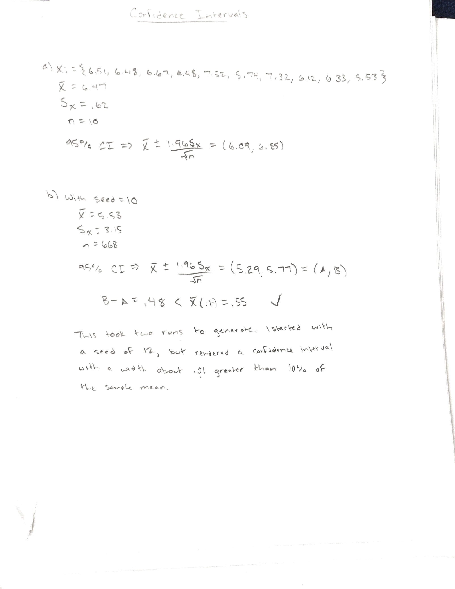

Train Simulator with CSIM for Java
==================================

##### James Albert, 16004325

Running the simulator, we can observe a lot about what happened in 7200 hours. Using a seed of 12, a total of 642 trains were served. As time progresses (figuratively), we can see trains on average receive around 3.5 (3.44) hours of service time. The dock is busy, idle, and hogged out 35.49%, 61.69%, and 2.56% of 7200 hours respectively. These add up to 99.5% (essentially 100%) because the 'busy', 'idle', and 'hogged-out' states for the dock are mutually exclusive. This means that the dock can only be in 1 of 3 states at one time the entire time. The reason it's not exactly 100% though is because it cuts off at exactly 7200 hours, leaving dangling processes. As for the queue, there were at most 3 trains in the queue at once, averaging up to 1.44 hours spent in the queue per train.

#### Output

```
                  CSIM/Java Simulation Report

                         TrainSimulator

                February 9, 2017 1:41:41 AM PST

           Ending Simulation time:           7200.000
           Elapsed Simulation time:          7200.000
           Execution (CPU) time:                1.019

FACILITY SUMMARY

facility     service    service          through-    queue     response   compl
name           disc      time    util.     put       length       time    count
--------------------------------------------------------------------------------
Dock         fcfs       4.28116  0.381    0.08889    0.38055    4.28116      640

Table 0: Time in Queue

      minimum         0.000000           mean                     1.436939
      maximum        33.439014           variance                10.252996
      range          33.439014           standard deviation       3.202030
      observations         640           coefficient of var       2.228368

Table 1: Time in System

      minimum         3.500316           mean                     5.718104
      maximum        36.996784           variance                14.013601
      range          33.496468           standard deviation       3.743475
      observations         640           coefficient of var       0.654671


      confidence intervals for the mean after 600 observations

      > insufficient observations to compute confidence intervals

Table 2: Time Dock was Busy

      minimum         0.052914           mean                     3.645601
      maximum         4.498624           variance                 0.930547
      range           4.445710           standard deviation       0.964649
      observations         701           coefficient of var       0.264606

Table 3: Time Dock was Hogged

      minimum         2.505515           mean                     3.022611
      maximum         3.497485           variance                 0.084744
      range           0.991970           standard deviation       0.291108
      observations          61           coefficient of var       0.096310

Table 4: Time Dock was Idle

      minimum         0.000000           mean                     6.939990
      maximum        85.401941           variance               106.570076
      range          85.401941           standard deviation      10.323278
      observations         640           coefficient of var       1.487506

Table 5: Hogged Out Trains

      minimum         0.000000           mean                     0.123438
      maximum         3.000000           variance                 0.139669
      range           3.000000           standard deviation       0.373723
      observations         640           coefficient of var       3.027630

                                                 cumulative
     lower limit       frequency    proportion   proportion
         0.00000             569     0.889062     0.889062  ********************
         1.00000              65     0.101562     0.990625  **                 
         2.00000               4     0.006250     0.996875  .
         3.00000               2     0.003125     1.000000  .


QTABLE 0:  Number of Trains in Queue

      initial       0      minimum       0      mean                    0.127728
      final         0      maximum       3      variance                0.175277
      entries     640      range         3      standard deviation      0.418661
      exits       640                           coeff of variation      3.277757
Time Dock was Busy: 35.493976%
Time Dock was Hogged: 2.560823%
Time Dock was Idle: 61.688797%
With a total of 99.743597%
```

#### The Glorious Histogram

The histogram comes out a little weird in the PDF, so this is just a nicer format than what you see above.

```
0 ******************** - 569 trains didn't hogout
1 ** - 65 trains hogged out once
2 . - 4 trains hogged out twice
3 . - 2 trains hogged out thrice
```

#### Brief Sequence of Events

```
$ javac TrainSimulator.java
$ java TrainSimulator # defaults to 7200 hours with mean 10
time      process  id   pri    status
0.000          Sim   1     1    create Sim 1
0.000          Sim   1     1    init facility Dock with 1 server(s)
0.000          Sim   1     1    create event NotInUse
0.000          Sim   1     1    create event NotIdle
0.000          Sim   1     1    create event Idle
0.000          Sim   1     1    sched proc: t = 0.000, id = 2
0.000          Sim   1     1    create Idle Checker 2
0.000          Sim   1     1    set event Idle
0.000          Sim   1     1    sched proc: t = 0.000, id = 3
0.000          Sim   1     1    create TrainGenerator 3
0.000          Sim   1     1    hold for 7200.000
0.000          Sim   1     1    sched proc: t = 7200.000, id = 1
0.000 Idle Checker   2     1    wait event Idle
0.000 Idle Checker   2     1    wait event NotIdle
0.000 TrainGenerator   3     1    set event NotInUse
0.000 TrainGenerator   3     1    create event Hogout
0.000 TrainGenerator   3     1    create event Hogin
0.000 TrainGenerator   3     1    sched proc: t = 0.000, id = 4
0.000 TrainGenerator   3     1    create Train 4
```
...

```
7193.872         Crew 1356     1    set event Hogout
7193.872         Crew 1356     1    hold for 3.093
7193.872         Crew 1356     1    sched proc: t = 3.093, id = 1356
7195.948 TrainGenerator   3     1    create event Hogout
7195.948 TrainGenerator   3     1    create event Hogin
7195.948 TrainGenerator   3     1    sched proc: t = 0.000, id = 1357
7195.948 TrainGenerator   3     1    create Train 1357
7195.948 TrainGenerator   3     1    hold for 8.331
7195.948 TrainGenerator   3     1    sched proc: t = 8.331, id = 3
7195.948        Train 1357     1    sched proc: t = 0.000, id = 1358
7195.948        Train 1357     1    create Crew 1358
7195.948        Train 1357     1    hold for 0.000
7195.948        Train 1357     1    sched proc: t = 0.000, id = 1357
7195.948         Crew 1358     1    hold for 8.611
7195.948         Crew 1358     1    sched proc: t = 8.611, id = 1358
7195.948        Train 1357     1    timed queue: NotInUse 8.611
7195.948        Train 1357     1    sched proc: t = 8.611, id = 1357
7195.948        Train 1357     1    queue on event NotInUse
7195.948        Train 1357     1    timed_q recog evt NotInUse
7195.948        Train 1357     1    set event NotIdle
7195.948 Idle Checker   2     1    recog2 evt NotIdle
7195.948        Train 1357     1    sched proc: t = 0.000, id = 2
7195.948        Train 1357     1    create event End Service
7195.948        Train 1357     1    reserve facility Dock
7195.948        Train 1357     1    hold for 4.462
7195.948        Train 1357     1    sched proc: t = 4.462, id = 1357
7195.948 Idle Checker   2     1    wait event Idle
7196.965         Crew 1356     1    set event Hogin
7196.965         Crew 1356     1    terminate process
7200.000          Sim   1     1    terminate process
7200.000          Sim   1     1    halt simulation
```
I've left `model.enableTrace(true)` in my code in case you wanted to check out the rest; disable it by commenting out line 22. I also have the seed set to 12; disable it by commenting out line 57.

#### Confidence Intervals


