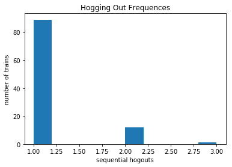

Train Simulation
================

###### James Albert, 16004325

```python
from lib import *

Simulator(mu=10, limit=7200, verbose=False) \
  .start() \
  .analyze()
```

Running the simulator, we can observe a lot about what happened in 7200 hours. A total of 718 trains were served by the time it finished. Although the maximum number of trains simultaneously existing in the system, it was more often between 0 and 1 trains existing at once. Throughout the simulation, the percentages of time the dock was idle, busy, and hogged-out are 1.47%, 36.81%, and 0.52% respectively. These add up to 38.74% (not 100%) because the 'busy', 'idle', and 'hogged-out' states for the dock are not mutually exclusive. As for the queue, there were at most 5 trains in the queue at once, averaging up to 2.63 hours per train wait time.



#### Stats

    trains served: 702
    average time train is in system: 7.01h
    max time train is in system: 72.50h
    total dock idle: 0.91%
    total dock busy: 35.99%
    total dock hogged-out: 0.42%
    maximum # trains in queue: 4 trains
    average time in queue: 2.15h
