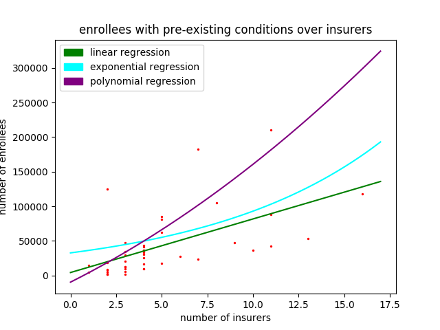

The Affordable Care Act and You
===============================

##### James Albert 16004325

### Getting Started

#### Synopsis

Let's begin with the information I used as a basis for my simulation. Before the ACA, 48.6 million people were uninsured. After it's implementation, 20 million people gained coverage. This brought the uninsured rate down below 10% nationally. With that, let's look at a few states that have participated the most/least in the ACA. Here's a table representing my findings.

| State                | Individual Participants | Number of Insurers |
|----------------------|-------------------------|--------------------|
| California           | 1,412,200               | 11                 |
| Florida              | 1,531,714               | 10                 |
| Hawaii               | 13,313                  | 2                  |
| North Dakota | 20,536                  | 3                  |

The above data was pulled from [6]

#### Analysis

From this data, we can deduce that the number of individual participants and the number of insurers are in some way correlated. It is with this simulation that we aim to answer why. What makes an insurer likely to choose to participate in a marketplace. And given that more insurers who do participate were to become available in a state with very few insurers, would that lead to an increase in individual participation? Let us find out.

#### Factors of Health

Here is a table of rates in certain health conditions in each of the above states.

**State**|**Cancer**|**Diabetes**|**Obesity**|**Heart Disease**|**Stroke**
:-----:|:-----:|:-----:|:-----:|:-----:|:-----:
California|.4028%|9.9%|24.2% (47 rank)|.2846%|.06%
Florida|.413%|9.4%|26.8% (35 rank)|.2909%|.0651%
Hawaii|.419%|8.9%|31.0% (17 rank)|.2849%|.0694%
N. Dakota|.433%|8.0%|22.7% (49 rank)|.2641%|.0652%

##### Extrema Tables

For reference, here are the extrema tables for each condition nationally with maximum being the first entry, minimum being the second entry.

**State**|**Cancer**|**Diabetes**|**Obesity**|**Heart Disease**|**Stroke**
:-----:|:-----:|:-----:|:-----:|:-----:|:-----:
Kentucky|.5117%||||
New Mexico|.3637%||||    
Puerto Rico||14.2%|||
Vermont||6.9%|||
Louisiana|||36.2% (1 rank)||
Colorado|||20.2% (51 rank)||
Guam||||.5231%|
Puerto Rico||||.2183%|
Guam|||||.1244%
Puerto Rico|||||.0565%

Health data was pulled from [1], [2], [3], [4]

It doesn't seem likely that health condition rates have any obvious correlation with insurer participation. The four states in question are all more or less around each other.

#### Factors of Financials

Now let's look at income salaries adjusted to cost of living

**State**|**Salary**
:-----:|:-----:
California|$67,458
Florida|$44,299
Hawaii|$62,814
N. Dakota|$51,704

##### Extrema Table

**State**|**Salary**
:-----:|:-----:
Maryland|$70,004
Puerto Rico|$23,168

Again, no obvious correlation. There are all relatively around the mean. Financial data was pulled from [7]

#### Further Analysis

We've looked at various health condition rates in the discussed states; no obvious correlation. We've seen salaries across these states; no obvious correlation. These four states are on the two extremes of insurer participation, yet they are all within pretty close range of the median.

#### Another Look at Health

With a clear correlation still yet to be found, I went back and looked over other factors like the amount of people who have a pre-existing condition per state. Here's what I found

**State**|**People with pre-existing conditions**
:-----:|:-----:
California|333,986
Florida|229,902
Hawaii|3,808
N. Dakota|2,070

Now that's what I call a correlation. In fact, let's look the rest of the states:

| State          | Enrollees (y) | Insurers (x) | $x - \bar{x}$ | $y - \bar{y}$ | $(x - \bar{x})^2$ | $(x - \bar{x})*(y - \bar{y}$) |
| -------------- | ------------- | ------------ | ---------- | ---------- | -------------- | ------------------------- |
| Alabama        | 18230         | 2            | -3.05      | -32705.83  | 9.30           | 99752.78                  |
| Alaska         | 1442          | 2            | -3.05      | -49493.83  | 9.30           | 150956.18                 |
| Arizona        | 105246        | 8            | 2.95       | 54310.17   | 8.70           | 160215.00                 |
| Arkansas       | 20520         | 3            | -2.05      | -30415.83  | 4.20           | 62352.45                  |
| Colorado       | 36655         | 10           | 4.95       | -14280.83  | 24.50          | -70690.11                 |
| Connecticut    | 12921         | 3            | -2.05      | -38014.83  | 4.20           | 77930.40                  |
| Delaware       | 7209          | 2            | -3.05      | -43726.83  | 9.30           | 133366.83                 |
| Georgia        | 81014         | 5            | -0.05      | 30078.16   | 0.00           | -1503.91                  |
| Idaho          | 16786         | 4            | -1.05      | -34149.83  | 1.10           | 35857.32                  |
| Illinois       | 84881         | 5            | -0.05      | 33945.17   | 0.00           | -1697.26                  |
| Indiana        | 41670         | 4            | -1.05      | -9265.83   | 1.10           | 9729.12                   |
| Iowa           | 9734          | 4            | -1.05      | -41201.83  | 1.10           | 43261.92                  |
| Kansas         | 12699         | 3            | -2.05      | -38236.83  | 4.20           | 78385.50                  |
| Kentucky       | 29301         | 3            | -2.05      | -21634.83  | 4.20           | 44351.40                  |
| Louisiana      | 33224         | 4            | -1.05      | -17711.83  | 1.10           | 18597.42                  |
| Maine          | 1396          | 2            | -3.05      | -49539.83  | 9.30           | 151096.48                 |
| Maryland       | 36193         | 4            | -1.05      | -14742.83  | 1.10           | 15479.97                  |
| Michigan       | 47293         | 9            | 3.95       | -3642.83   | 15.60          | -14389.18                 |
| Minnesota      | 17375         | 5            | -0.05      | -33560.83  | 0.00           | 1678.04                   |
| Mississippi    | 8722          | 2            | -3.05      | -42213.83  | 9.30           | 128752.18                 |
| Montana        | 9952          | 3            | -2.05      | -40983.83  | 4.20           | 84016.85                  |
| Nebraska       | 9464          | 4            | -1.05      | -41471.83  | 1.10           | 43545.42                  |
| Nevada         | 30073         | 4            | -1.05      | -20862.83  | 1.10           | 21905.97                  |
| New Hampshire  | 14935         | 1            | -4.05      | -36000.83  | 16.40          | 145803.36                 |
| New Jersey     | 34723         | 3            | -2.05      | -16212.83  | 4.20           | 33236.30                  |
| New Mexico     | 36800         | 4            | -1.05      | -14135.83  | 1.10           | 14842.62                  |
| New York       | 118048        | 16           | 10.95      | 67112.17   | 119.90         | 734878.26                 |
| North Carolina | 125213        | 2            | -3.05      | 74277.17   | 9.30           | -226545.37                |
| North Dakota   | 2070          | 3            | -2.05      | -48865.83  | 4.20           | 100174.95                 |
| Ohio           | 88113         | 11           | 5.95       | 37177.17   | 35.40          | 221204.16                 |
| Oklahoma       | 25112         | 4            | -1.05      | -25823.83  | 1.10           | 27115.02                  |
| Oregon         | 42522         | 11           | 5.95       | -8413.83   | 35.40          | -50062.29                 |
| Pennsylvania   | 182633        | 7            | 1.95       | 131697.17  | 3.80           | 256809.48                 |
| Rhode Island   | 4870          | 2            | -3.05      | -46065.83  | 9.30           | 140500.78                 |
| South Carolina | 47660         | 3            | -2.05      | -3275.83   | 4.20           | 6715.45                   |
| South Dakota   | 5340          | 3            | -2.05      | -45595.83  | 4.20           | 93471.45                  |
| Tennessee      | 43672         | 4            | -1.05      | -7263.83   | 1.10           | 7627.02                   |
| Texas          | 210076        | 11           | 5.95       | 159140.17  | 35.40          | 946884.01                 |
| Utah           | 27598         | 6            | 0.95       | -23337.83  | 0.90           | -22170.94                 |
| Virginia       | 62655         | 5            | -0.05      | 11719.17   | 0.00           | -585.96                   |
| Washington     | 23701         | 7            | 1.95       | -27234.83  | 3.80           | -53107.92                 |
| West Virginia  | 4191          | 1            | -4.05      | -46744.83  | 16.40          | 189316.56                 |
| Wisconsin      | 53305         | 13           | 7.95       | 2369.17    | 63.20          | 18834.90                  |

Above data was pulled from [5], [6]. The table above was originally the first 3 columns, but with a little bit of python, I converted the above table to a parsable format and made the appropriate calculations.

\newpage

and here's a scatter plot of the data:


Now that the we can visualize the data, we can use regression to derive a line that best fits the scatter plot:

Given \newline
x = number of insurers participating in state's marketplace, \newline
y = number of enrollees with pre-existing conditions

$$\hat{y} = b_0 + b_1 \times x \newline$$
$$\frac{1}{n} \times \sum y_i = 42447.37 \newline$$
$$\frac{1}{n} \times \sum x_i = 4.93 \newline$$
$$\sum (x - \bar{x}) = 493.3 \newline$$
$$\sum (x - \bar{x}) \times (y - \bar{y}) = 3857892.61 \newline$$
$$b_1 = \frac{\sum (x - \bar{x}) \times (y - \bar{y})}{\sum (x - \bar{x})^2} = 7739.95 \newline$$
$$p_\mu = (4.93, 42447.37) \newline$$
$$42447.37 = b_0 + 38157.95 \newline$$
$$b_0 = 4289.42 \newline$$
$$\hat{y} = 4289.42 + 7739.95 \times x$$

\newpage

And with python, I was able to render the following graph:



Now, we can see that there is a positive relationship between the number of enrollees with pre-existing conditions (the dependent variable) and the number of insurers participating in that state's marketplace (the independent variable). While it does fit the data, let's see if we can find a better fit. I ran this data through an exponential regression tool [8] which returned $y = 32666.80339 \times ​e^{0.104535465x}$

It's important to note that this correlation is not true across the entire domain. Notice how points are more concentrated towards the lower-left end of the graph, and then taper off as the number of insurers/number of enrollees increase. We can see that the correlation weakens when the number of insurers reach >= 6 or when the number of enrollees reach >= 75,000. With that, the exponential and linear curves don't seem to account for the more scattered areas of the graph. I used the same regression tool [8] to derive the polynomial regression curve $y = 374.580138 \times x^2 + 13279.17888 \times x - 9624.294681$ and that seems to fit the data better.

\newpage

#### Conclusion

If we go back and reanalyze the data on health and income:


We've been trying to see what correlates the insurer participating in one marketplace over the other: was it health stats or income rates? The data seems to suggest that insurers participate in marketplaces with more patients with (reported) pre-existing conditions; "reported" is the keyword. While health conditions are high when 1 < insurers < 6, many of them may not get reported as pre-existing conditions because there aren't as many insurers. And while pre-existing conditions are high when enrollees > 75,000 or insurers > 6, many of them may not get reported as health conditions because the patients are getting preventive care and treatment (with the exception of cancer which is relatively uniform across number of insurers).

Since the data seems to fall under a multinomial distribution, I was able to simulate the distribution of insurers participating in a states marketplace. Here's the code to do so:

```
occurances = dict()
probabilities = dict()
sim_domain = list()
for x in domain:
    occurances[x] = domain.count(x)
    probabilities[x] = occurances[x] / len(domain)

sim_occurances = np.random.multinomial(n=43, pvals=probabilities)
for var, occ in zip(set(domain), sim_occurances):
    sim_domain.extend([var] * occ)
matplotlib.pyplot.scatter(sim_domain, range_, s=2)
matplotlib.pyplot.show()
```

This code is not meant to be run directly, I got rid of a lot of the required list conversions so that it looked cleaner. It's just to show that I simulated it. The actual code is in the included file `project.py`. Here's the resulting graph:

\newpage


I think we have figured out what correlates the insurer participating in one marketplace over the other. It correlates with the number of enrollees with pre-existing conditions, of which demonstrates trends in reported health conditions in states with fewer insurers. But what's more important is that we now have a distribution we can model our data around, to which we can add other variables in the mix if we wanted to test changes in the simulated environment. For example, if we wanted to test the effect of 4 new insurers participating in Alabama's marketplace, we could do that using a model who's foundation is based on the data in this paper.

Confidence in simulation correctness:

I was able to calculate the following data using python and online statistics calculators

$$\mu_{pop} = 4.9302325581395$$
$$\sigma_{pop} = 3.3852989207936$$
$$n = 43$$
$$s = 3.4253630244678$$
$$dof = n - 1 = 42$$
$$c = 0.95$$
$$t_{c} = 0.8262$$
95% confidence interval for $\mu_{pop}$ =
$$[\mu_{pop} - t_c \times \frac{s}{\sqrt{n}}, \mu_{pop} + t_c \times \frac{s}{\sqrt{n}}] =$$
$$[4.93 - 0.8262 \times 0.0796596052, 4.93 + 0.8262 \times 0.0796596052] =$$
$$[4.86418523, 4.99581477]$$

I ran my simulation once first and got an initial mean of 4.95. I proceeded to run it 100 times and got an average mean of 4.96. I can safely say I'm 95% confident in my simulated plots results. Now if I was a policy maker, I would use this simulation to introduce experimental variables to observe the possible changes that may take place. I've included `simulation.mp4` which shows the convergence between the sample and simulated data.

\newpage

#### References

The following links are clickable. Try it, you can actually click them. The strawberries taste like strawberries! The snozzberries taste like snozzberries!

[1] cancer \url{https://www.cdc.gov/cancer/dcpc/data/state.htm}

[2] diabetes \url{https://www.cdc.gov/diabetes/data/}

[3] obesity \url{http://stateofobesity.org/adult-obesity/}

[4] heart disease & stroke \url{https://www.cdc.gov/widgets/infographics/index.html}

[5] pre-existing \url{https://www.cms.gov/cciio/resources/fact-sheets-and-faqs/pcip-enrollment.html}

[6] insurers \url{http://kff.org/other/state-indicator/number-of-issuers-participating-in-the-individual-health-insurance-marketplace/?activeTab=map&currentTimeframe=0&selectedDistributions=total-number-of-issuers-in-the-marketplace__2014&sortModel=%7B%22colId%22:%22Location%22,%22sort%22:%22asc%22%7D}

[7] income \url{https://en.wikipedia.org/wiki/List_of_U.S._states_by_income}

[8] regression \url{http://www.xuru.org/rt/ExpR.asp#CopyPaste}
