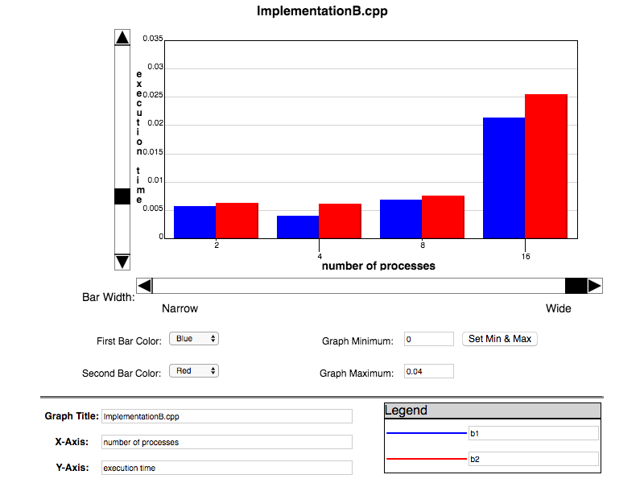

ImplementationB.cpp Timing
==========================

###### James Albert, 16004325

The above graph shows the execution time of ImplementationB.cpp with 2, 4, 8, and 16 processes. Here is a table of the exact times:

| time for b1 | time for b2 | number for processes |
|-------------|-------------|----------------------|
| 0.00562096  | 0.00628304  | 2                    |
| 0.00395012  | 0.00618005  | 4                    |
| 0.00687599  | 0.00754285  | 8                    |
| 0.0213192   | 0.0255101   | 16                   |

The word I chose for testing was "the"; my reasoning was that it's a very common word and will therefore most likely show us the worst-case bounds of the algorithm. The blue bars represent the use of MPI_Reduce (b1), and the red bars represent the ring topology implementation (b2). Before I explain the differences between the two, let's see what each implementation tells us. Using MPI_Reduce, it takes about .005 second to finish. Then we bump it up to 4 threads (noticing a speed up). But once we set it to 8 and 16 processes, we start to notice a slow down. The same exact pattern happens with the ring topology implementation. But then I was asking myself:

The answer is simple. Running `sysctl -n hw.ncpu`, I see that I only have 4 (logical) cpu cores and 1 cpu. That means when I set the number of processes to 2, my cpu says "sure man, this is a piece of cake". I set it to 4 processes and my cpu is like "no problem, homie. I gotchu. In fact, I can distribute that load across more cores evenly so I can do this even faster now!". But once I set it to 8 and 16, my cpu complains "yo homie, chill out with those processes. I only have 4 cores and can only execute 1 process per core. I thought we were friends...".

I also ran my code using SGE and here's a graph with the timing data. The black curve represents MPI_Reduce and the thin grey line represents the ring topology. The same patterns are apparent.

Okay, on to the other things:

  1. **What is the topology used by MPI to implement its Reduce?**

    The topology is shown in the discussion slides:

    

    It uses what's called the star topology. It takes the sum (or whatever operation the user specifies) of all the elements that are sent from all other processes, and stores the aggregate in the root process's specified variable. This method is blocking and will wait for all other processes to send before carrying on. This topology is very similar to that of the MPI_Gather method.
  2. **How does the ring topology affect the runtime?**

    Well, going solely off the data, I would have to say that the ring topology slows down runtime. There may be several reasons for this, but I'd imagine the main reason for this is that there are more operations to complete and messages to send for each process. For example, for MPI_Reduce, each process only has to send one message and it's to a constant ranked process (the root). For ring topology, each process must receive the result of the previous process, do their work, perform the summation, and send their result to the next process.
  3.  **Is there a case where the ring topology may be faster?**

    Sure. If I wanted to, I could make my ring topology bidirectional and a little smarter when it comes to passing the results around. The current implementation takes a very naive approach so it's obviously going to suffer from superfluous message passing (as opposed to the tried and true MPI_Reduce method).
  4. **How many messages are passed between machines when program is run with 2, 4, 8, and 16 processes?**

    For MPI_Reduce:

      2 procs: 2 messages

      4 procs: 4 messages

      8 procs: 8 messages

      16 procs: 16 messages

    For ring topology:

      2 procs: 4 messages

      4 procs: 8 messages

      8 procs: 16 messages

      16 procs: 32 messages
