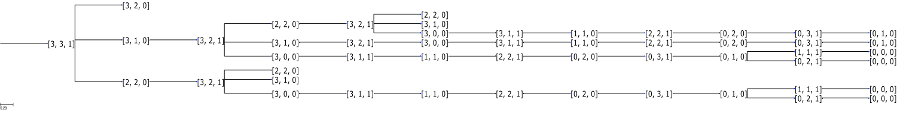

177 HW2
=======

###### James Albert, 16004325

**note:** if you're going to run `3.9.py`, use python 2.7.x. It uses the ete3 library which does not have python 3 support. `search.py` does of course require python 3. But you don't have to run `3.9.py`, all it does is generate the images (`3.9.a.png` and `3.9.b.gif`) to answer the questions below.

1) 3.9
  - a) I wrote a script `3.9.py` to generate the following state space  If the above (or any) image is unclear, I've attached all images referenced in this assignment that you can open and zoom in to check for validity. The formulation of this task is simple; it's implemented in `3.9.py` as well. States in this problem are described as an array. The initial state being `[3, 3, 1]`, we can say that there are 3 missionaries, 3 cannibals, and 1 boat on the wrong side of the river. The children of the states are results from actions which include `[1, 0, 1], [2, 0, 1], [0, 1, 1], [0, 2, 1], [1, 1, 1]`. Depending on which side of the river the current state indicates, we either add (wrong side) or subtract (right side) to or from the current state. If we start at the initial state and then apply the first action `[1, 0, 1]`, then we get a result state `[2, 3, 0]` which is invalid because there are 3 cannibals and 2 missionaries on the wrong side. If we apply the third action `[0, 1, 1]`, then we get the result state `[3, 2, 0]` which is valid for the same reason. More on this at answer c). Each state that results from applying an action and of which is valid are children of the current state. The goal is reached if the current state is `[0, 0, 0]` meaning all missionaries and cannibals are on the correct side of the river. To formulate this problem:
    - **States**: Each state is represented as an array which shows how many missionaries, cannibals, and boats are one the wrong side of the river.
    - **Initial State**: [3, 3, 1] which says there are 3 missionaries, 3 cannibals, and 1 boat on the wrong side of the river.
    - **Actions**: An action is also an array; for example, [1, 0, 1] which says subtract 1 missionary, 0 cannibals, and use the boat to transfer the missionary across the river.
    - **Transition Model**: A valid action to a state is one that results in 1) not leaving more cannibals than missionaries on either side of the river and 2) there are enough missionaries and cannibals to add or subtract.
    - **Goal Test**: The state will pass the goal test if the state is [0, 0, 0] meaning all missionaries, cannibals, and boat(s) are on the right side of the river.
    - Path Cost: each step cost is 1, so path cost = number of steps in the path
  - b) Using the `3.9.py`, I generated a gif to  demonstrate a breadth-first search of the tree. BFS is optimal if the step costs are identical, which in this case they are. Note the goal states are at the end of the gif where I added an extra delay for you guys to check.
  
  - c) While the state space is simple, I think people might have a hard time solving this puzzle because you can get stuck in a recursive loop if you're not minding state while going back and fourth across the river. As mentioned in answer a), the validity of a result of an action determines the safety of the missionaries. You must be sure that both sides are safe for the missionaries, not just the wrong side.

2) 3.16
  - a) So we have a train track set which includes 12 straight pieces, 2 out-fork pieces, 2 in-fork pieces, and 16 curved pieces. We are given rules that there may not be any overlapping tracks and no loose ends where trains can run off of. We are also given the premise that all pieces fit together *exactly* with no slack. We must formulate a task as a search problem.
    - **States**: Each state is represented as a grid which displays our built-so-far tracks. Each block in the grid is filled in (or marked as taken) if a track piece has been placed there.
    - **Initial State**: an empty grid.
    - **Actions**: An action is the placement of a new piece to a state.
    - **Transition Model**: A valid action to a state is one that results in 1) a physically possible connection (the male connecting piece matches the female connecting piece) and 2) the new piece being added is placed on an untaken block in the grid.
    - **Goal Test**: The state will pass the goal test if 1) all track pieces have been used and 2) there are no loose ends. We can check for loose ends easily if we represent each track piece as an individual class. Within that class, we maintain a record of each connecting piece of that track and whether or not they are taken. The goal test will iterate over all track pieces in the grid and if one piece is shown to have at least 1 connecting piece not connected to anything, it fails. Otherwise, it passes.
    - Path Cost: each step cost is 1, so path cost = number of steps in the path
  - b) We can create a tree representing all valid states, and since all step costs are also equal in this case, we can use breadth-first search as an optimal method to find the goal state. reasons described above.
  - c) With the original set of track pieces, you have 34 in-pieces and 34 out-pieces. You need this equality for this problem to be solvable. Taking away one fork leaves either 33 in-pieces and 32 out-pieces or 32 in-pieces and 33 out-pieces; you would always have at least one piece not connected to anything thus breaking the "no loose ends" rule. Therefore, taking away a fork piece renders this problem unsolvable.
  - d) Since we're using Breadth-First Search, so here are some things we already know: BFS is complete if the branching factor is finite, and is optimal if all step costs are equal. We can't really do anything about the step costs, but we can make the branching factor (practically) infinite. So I propose that given some branching factor, b, and some shallowest depth of the solution, d, such that b^d >= 6.308*(10^18), it would take 100 years for BFS to solve this problem.

3) 3.22
  - I included the `search.py` to which I added the `EightPuzzleSearchProblem` and `TSPSearchProblem` classes. The script I wrote to generate the random initial states and measure the performance of the searchers is `hw2.py`.
  - Results of randomly generated solvable 8-puzzle problems
    - A*
      - 2.544 seconds
    - RBFS
      - 11.956 seconds
    - I experience a significant increase in runtime when adding a small random integer to the heuristic value using RBFS; in fact, its average (162.628 seconds) increased 1360%.
  - Results of randomly generated TSP problems
    - A*
      - 0.003118 seconds
    - RBFS
      - 0.022078 seconds
