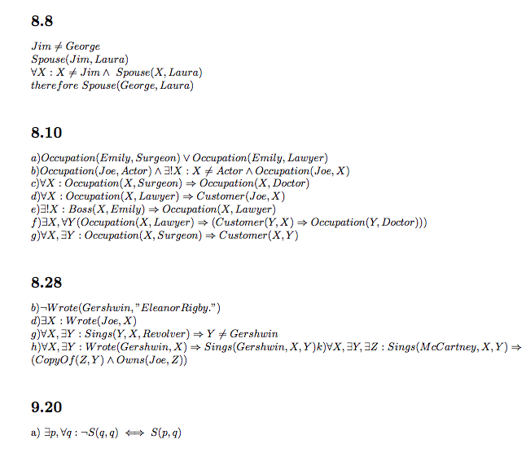
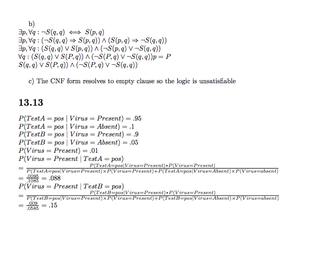

171 HW5
=======

##### James Albert, 16004325

I tried doing as much work in mardown as possible, but it got very math-y so I used latex for part of it. The first set of problems (9.9, 13.8, and 14.1) are done in markdown. The second set of problems (8.8, 8.10, 8.28, 9.20, and 13.13) are done in latex. I couldn't merge the two due to font type problems that were a headache, so I took images of the latex output and pasted them in the markdown. My apologies if a couple problems are out of order.




#### 9.9

**note:** I'll be referring to goals and axioms as Gx and Ax where x is the identifier.

a)
```
G1: 7 <= 3 + 9; A8{x1 / 7, z1 / (3 + 9)}
G2: 7 <= y1; A4{x2 / 7, y1 / (7 + 0)} (success)
G3: 7 + 0 <= 3 + 9; A8{x3 / (7 + 0), z3 / (3 + 9)}
G4: 7 + 0 <= y3; A6{x4 / 7, y4 / 0, y3 / (0 + 7)} (success)
G5: 0 + 7 <= 3 + 9; A7{w5 / 0, x5 / 7, y5 / 3, z5 / 9}
0 <= 3; A1 (success)
7 <= 9; A2 (success)
G1, G3, G5 (success)
```

b)
```
infer from A1, A2, A7 {w / 0, x / 7, y / 3, z / 9}
A9: 0 + 7 <= 3 + 9
infer from A9, A6, A8 {x1 / 0, y1 / 7, x2 / (0 + 7), y2 / (7 + 0), z2 / (3 + 9)}
A10: 7 + 0 <= 3 + 9
infer from A4, A10, A8
{x3 / 7, x4 / 7, y4 / (7 + 0), z4 / (3 + 9)}
A11: |7 <= 3 + 9
```

#### 13.8
```
a) P(Toothache) = 0.108 + 0.012 + 0.016 + 0.064
                = 0.2
b) P(Cavity) = <0.2, 0.8>
             = 0.108 + 0.012 + 0.072 + 0.008
             = 0.2
c) P(Toothache|Cavity) = <(.108+.012)/2, (0.072+0.008)/0.2>
                       = <0.6, 0.4>
                       = .6
d) P(Cavity V Catch) = 0.108 + 0.012 + 0.016 + 0.064 + 0.072 + 0.144
                     = 0.416
therefore,
P(Cavity|Toothache V Catch)
  = <(0.108 + 0.012 + 0.072) / 0.416, (0.016 + 0.064 + 0.144) / 0.416>
  = <0.4615, 0.5384>
```

#### 14.1
a)
```
let RV C have domain {a, b, c}
In the network, C is the root and X1, X2, X3 are the children.
CPT for C:
| C | P(C) |
|---|------|
| a | 1/3  |
| b | 1/3  |
| c | 1/3  |
CPT for Xi
| C |  X1   | P(C) |
|---|-------|------|
| a | heads |  .2  |
| b | heads |  .6  |
| c | heads |  .8  |
```
b)
```
P(X1=tails, X2=heads, X3=heads | C=a)
  = .8 * .2 * .2 = .032
P(2 heads, 1 tails | C=a) = 3 * .032 = .096
P(" " " " | C=b) = .432
P(" " " " | C=c) = .384
therefore, b is most likely to be drawn
```
